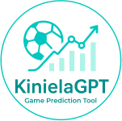

<div align="left">
  
  
  <div>
    <h1>KinielaGPT - Kiniela Game Prediction Tool</h1>
  </div>
  <br clear="left"/>
</div>

<p align="left">
  <a href="https://www.python.org/downloads/"></a>
  <a href="https://modelcontextprotocol.io"></a>
  <a href="https://www.gnu.org/licenses/agpl-3.0"></a>
  <a href="https://ricardomoya.github.io/KinielaGPT/"></a>
</p>

**KinielaGPT** es un servidor MCP (Model Context Protocol) diseñado para potenciar tus predicciones de la Quiniela mediante un análisis avanzado de datos. Combina las probabilidades oficiales de LAE con un análisis contextual profundo: histórico de enfrentamientos, rachas recientes, clasificación y rendimiento como local o visitante. Ofrece tres estrategias de predicción, detección de sorpresas y un análisis pormenorizado partido a partido.

## 🎯 Características

- 🎲 **Predicción de Resultados**: Genera pronósticos mediante tres estrategias: *conservadora* (máxima probabilidad), *arriesgada* (balancea probabilidad y contexto) o *personalizada* (indicando el número de 'unos', 'equis' y 'doses').
- 📊 **Análisis Integral de Partidos**: Integra probabilidades de LAE, histórico de duelos (últimos 10 años), rachas, clasificación y contexto para ofrecer una predicción razonada.
- 🔍 **Detección de Sorpresas**: Detecta discrepancias entre las probabilidades oficiales y el rendimiento real (rachas, histórico, forma) para anticipar posibles sorpresas.
- 👥 **Estado de Forma de Equipos**: Evalúa el rendimiento detallado: últimos marcadores, rachas vigentes, desempeño local/visitante y tendencias clasificatorias.
- 📈 **Consulta Flexible de Datos**: Accede tanto a análisis interpretados como a los datos en bruto para sacar tus propias conclusiones.
- 🔌 **Servidor MCP Nativo**: Incluye 7 herramientas especializadas, totalmente compatibles con Claude Desktop, VS Code y otros clientes MCP.

## ✅ Antes de Empezar

Antes de usar `KinielaGPT` necesitaras tener instalado **UV** (recomendado) o **Python 3.10+** instalado en tu sistema.

A continuación se muestran como instalar las dos opciones, aunque debes elegir **una** de las dos:

### Opción 1: UV (Recomendado) ⚡

UV es un gestor de paquetes y proyectos Python ultrarrápido que simplifica la instalación y ejecución de herramientas Python. **No requiere tener Python pre-instalado**, ya que UV lo gestiona automáticamente. Además, ofrece aislamiento de entornos y una instalación significativamente más rápida que pip tradicional.

<details>
<summary><b>🪟 Instalar UV en Windows</b></summary>

```powershell
powershell -ExecutionPolicy ByPass -c "irm https://astral.sh/uv/install.ps1 | iex"
```

Verificar:
```powershell
uv --version
```
</details>

<details>
<summary><b>🍎🐧 Instalar UV en macOS/Linux</b></summary>

```bash
curl -LsSf https://astral.sh/uv/install.sh | sh
```

Verificar:
```bash
uv --version
```

> Reinicia tu terminal después de la instalación.
</details>

---

### Opción 2: Python 3.10+ y pip

Si ya tienes Python instalado o prefieres el método tradicional, puedes usar pip (el gestor de paquetes estándar de Python). Requiere tener Python 3.10 o superior ya instalado en tu sistema.

<details>
<summary><b>🪟 Instalar Python en Windows</b></summary>

1. Descarga Python 3.10+ desde [python.org/downloads](https://www.python.org/downloads/)
2. **Marca "Add Python to PATH"** durante la instalación
3. Verifica:
```powershell
python --version
pip --version
```
</details>

<details>
<summary><b>🍎🐧 Instalar Python en macOS/Linux</b></summary>

**macOS:**
1. Ve a [python.org/downloads](https://www.python.org/downloads/)
2. Descarga Python 3.10+ para macOS
3. Ejecuta el instalador . pkg


**Linux (Ubuntu/Debian):**
```bash
sudo apt update
sudo apt install python3.10 python3-pip python3.10-venv
```

Verifica:
```bash
python3 --version
pip3 --version
```
</details>

---

## 🚀 Instalación

### Opción 1: Usando UV (recomendado)

Con UV instalado, **no necesitas instalar** KinielaGPT. Usarás `uvx` para ejecutarlo directamente (ver [Configuración](#-configuración)).

---

### Opción 2: Usando pip

```bash
pip install kinielagpt
```

---

## 🔧 Configuración

### 🤖 Configurar para Claude.app

Edita el archivo de configuración `claude_desktop_config.json` que según tu sistema operativo se encuentra en:

- **Windows:** `%APPDATA%\Claude\claude_desktop_config.json`
- **macOS/Linux:** `~/Library/Application Support/Claude/claude_desktop_config.json`

Añade una de las siguientes configuraciones según tu método de instalación:

<details>
<summary>Usando uvx</summary>

```json
{
  "mcpServers": {
    "kinielagpt": {
      "command": "uvx",
      "args": ["kinielagpt"]
    }
  }
}
```
</details>

<details>
<summary>Usando pip</summary>

```json
{
  "mcpServers": {
    "kinielagpt": {
      "command": "python",
      "args": ["-m", "kinielagpt"]
    }
  }
}
```

> **Nota:** En macOS/Linux, si `python` no funciona, usa `python3` en su lugar.
</details>

### 💻 Configurar para VS Code

**Instalación rápida (un clic):**

Haz clic en el siguiente botón para instalar automáticamente el servidor MCP en VS Code:

[](https://insiders.vscode.dev/redirect/mcp/install?name=kinielagpt&config=%7B%22command%22%3A%22python%22%2C%22args%22%3A%5B%22-m%22%2C%22kinielagpt%22%5D%7D)

**Instalación manual:**

Abre la Paleta de Comandos (`Ctrl + Shift + P`), ejecuta `MCP: Open User Configuration` y añade una de las siguientes configuraciones:

<details>
<summary>Usando uvx</summary>

```json
{
  "servers": {
    "kinielagpt": {
      "command": "uvx",
      "args": ["kinielagpt"]
    }
  }
}
```
</details>

<details>
<summary>Usando pip</summary>

```json
{
  "servers": {
    "kinielagpt": {
      "command": "python",
      "args": ["-m", "kinielagpt"]
    }
  }
}
```

> **Nota:** En macOS/Linux, si `python` no funciona, usa `python3` en su lugar.
</details>

> **Alternativa:** También puedes crear el archivo `.vscode/mcp.json` en tu workspace para compartir la configuración con otros. Más detalles en la [documentación oficial de VS Code MCP](https://code.visualstudio.com/docs/copilot/customization/mcp-servers).


## 📚 Documentación

La documentación completa está disponible en: **https://ricardomoya.github.io/KinielaGPT/**

Incluye:
- TODO

## 📖 ¿Cómo usar KinielaGPT?

Una vez configurado el MCP, puedes interactuar con tu LLM (Claude, Copilot, etc.) en lenguaje natural. Simplemente hazle preguntas como las siguientes:

**Consultas de información:**
- "¿Cuál es la última quiniela disponible?"
- "Muéstrame los partidos de la jornada 26 de la temporada 2025/2026"
- "¿Qué probabilidades tiene cada partido de la jornada actual?"

**Predicciones de quiniela:**
- "Dame una predicción conservadora para la jornada 26"
- "Quiero una predicción arriesgada para la próxima jornada"
- "Genera una quiniela personalizada con 7 unos, 4 equis y 4 doses"

**Análisis de partidos:**
- "Analiza el partido del Real Madrid de la jornada 26"
- "¿Qué pasará en el partido Villarreal - Getafe?"
- "Muéstrame el histórico de enfrentamientos del partido Alavés - Real Sociedad"

**Detección de sorpresas:**
- "¿Hay algún partido donde pueda haber sorpresa en la jornada 26?"
- "Detecta sorpresas con un umbral más sensible (threshold=20)"

**Análisis de equipos:**
- "¿Cómo está jugando el Rayo Vallecano últimamente?"
- "Analiza el rendimiento del Barcelona en la jornada 26"
- "¿Qué racha tiene el Atletico de Madrid actualmente?"

### Herramientas Disponibles

**Total: 7 herramientas MCP disponibles**

<details>
<summary>1. <code>get_last_quiniela</code></summary>

**Descripción:** Obtiene la información de la última quiniela disponible.  
**Devuelve:** Jornada, temporada y lista de partidos de la quiniela más reciente
</details>

<details>
<summary>2. <code>get_quiniela</code></summary>

**Descripción:** Obtiene la información de una jornada específica de quiniela.  
**Parámetros:**
- `jornada` (int): Número de jornada (mínimo: 1)
- `temporada` (int): Año de la temporada (mínimo: 2026)

**Devuelve:** Información completa con todos los partidos programados de la jornada
</details>

<details>
<summary>3. <code>get_probabilities</code></summary>

**Descripción:** Obtiene las probabilidades basadas en LAE para cada partido de una jornada.  
**Parámetros:**
- `jornada` (int): Número de jornada (mínimo: 1)
- `temporada` (int): Año de la temporada (mínimo: 2026)

**Devuelve:** Probabilidades de 1, X, 2 y pronósticos de goles para todos los partidos
</details>

<details>
<summary>4. <code>predict_quiniela</code></summary>

**Descripción:** Genera una predicción completa de quiniela con diferentes estrategias.  
**Parámetros:**
- `jornada` (int): Número de jornada (mínimo: 1)
- `temporada` (int): Año de la temporada (mínimo: 2000)
- `strategy` (string): Estrategia de predicción
  - `"conservadora"`: Máxima probabilidad
  - `"arriesgada"`: Balancea probabilidad y contexto
  - `"personalizada"`: Distribución personalizada de 1-X-2
- `custom_distribution` (object, opcional): Solo para estrategia personalizada
  - Ejemplo: `{"1": 7, "X": 4, "2": 4}`

**Devuelve:** Predicción completa de los 15 partidos según la estrategia elegida
</details>

<details>
<summary>5. <code>detect_surprises</code></summary>

**Descripción:** Identifica partidos con inconsistencias significativas entre probabilidades basadas en LAE y análisis contextual.  
**Parámetros:**
- `jornada` (int): Número de jornada (mínimo: 1)
- `temporada` (int): Año de la temporada (mínimo: 2026)
- `threshold` (float, opcional): Umbral de divergencia (0-100, default: 30)

**Devuelve:** Lista de partidos con alertas de posibles sorpresas, clasificadas por nivel de gravedad (🚨 ALERTA ROJA, ⚠️ ALERTA MEDIA, ⚠️ ALERTA)
</details>

<details>
<summary>6. <code>analyze_match</code></summary>

**Descripción:** Analiza un partido específico con dos modos de operación.  
**Parámetros:**
- `jornada` (int): Número de jornada (mínimo: 1)
- `temporada` (int): Año de la temporada (mínimo: 2026)
- `match_id` (int): ID del partido (1-15)
- `include_prediction` (bool, opcional, default: true):
  - `true`: Análisis completo con predicción justificada
  - `false`: Solo datos en crudo sin predicción

**Devuelve:**
- **Con predicción:** Predicción, nivel de confianza (ALTA/MEDIA/BAJA), justificación detallada, probabilidades, histórico, rachas, clasificación
- **Sin predicción:** Datos en crudo como histórico de enfrentamientos, evolución reciente, clasificaciones, comparativa de últimos partidos, datos destacados
</details>

<details>
<summary>7. <code>analyze_team</code></summary>

**Descripción:** Analiza el rendimiento completo de un equipo específico.  
**Parámetros:**
- `jornada` (int): Número de jornada (mínimo: 1)
- `temporada` (int): Año de la temporada (mínimo: 2000)
- `team_name` (string): Nombre del equipo (debe coincidir con el nombre en los datos)

**Devuelve:** Análisis completo con últimos resultados, rachas actuales, rendimiento como local/visitante, clasificación y tendencia (Excelente/Buena/Irregular/Mala)
</details>


## 🧪 Testing

TODO

El proyecto incluye una suite completa de tests organizados por módulo:

```bash
# Ejecutar todos los tests
# TODO
```

**Cobertura**: TODO

## 🤝 Contribuir

¡Las contribuciones son bienvenidas! Por favor:

1. Fork el repositorio
2. Crea una rama para tu feature (`git checkout -b feature/AmazingFeature`)
3. Commit tus cambios (`git commit -m 'Add some AmazingFeature'`)
4. Push a la rama (`git push origin feature/AmazingFeature`)
5. Abre un Pull Request

## 📏 Licencia

[](https://www.gnu.org/licenses/agpl-3.0)

Este proyecto está licenciado bajo [GNU Affero General Public License v3.0 (AGPL-3.0)](https://www.gnu.org/licenses/agpl-3.0).

**Esto significa que puedes:**
- ✅ Usar el código libremente (incluso comercialmente)
- ✅ Modificar y adaptar el proyecto
- ✅ Distribuir copias y versiones modificadas

**Bajo las siguientes condiciones:**
- 📝 **Copyleft**: Cualquier modificación debe ser AGPL-3.0 también
- 🌐 **Uso en red**: Si usas este código en un servidor/servicio, **debes compartir el código fuente**
- 📦 **Código abierto**: Toda versión modificada debe distribuirse con código fuente
- ©️ **Atribución**: Debes mantener los avisos de copyright

**Protección especial**: La AGPL-3.0 cierra la "laguna del servidor" – incluso si ejecutas este código como servicio web sin distribuir binarios, debes ofrecer el código fuente a tus usuarios.

Ver el archivo [LICENSE](LICENSE) para el texto legal completo.

## ⚠️ Disclaimer

Este proyecto es únicamente para fines de entretenimiento. Las predicciones no garantizan resultados y no deben usarse como única base para decisiones de apuestas. Juega responsablemente.


## 👨‍💻 Autor

**Ricardo Moya**
- 🐙 GitHub: [@RicardoMoya](https://github.com/RicardoMoya)
- 💼 LinkedIn: [Ricardo Moya, PhD](https://www.linkedin.com/in/phdricardomoya/)

## 📧 Contacto

Para preguntas, sugerencias o reportar issues:
- 📝 [GitHub Issues](https://github.com/RicardoMoya/KinielaGPT/issues)
- 💬 [GitHub Discussions](https://github.com/RicardoMoya/KinielaGPT/discussions)

---

Hecho con ❤️ por Ricardo Moya para los aficionados a la quiniela española
